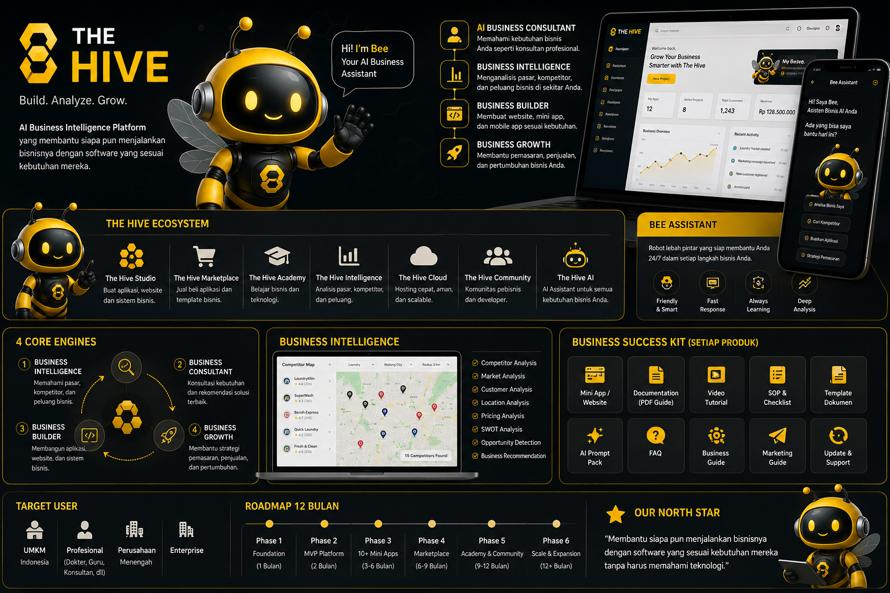

<p align="center">
  
</p>

# THE HIVE: AI Business Operating System for Indonesian SMEs

> **Status:** Paused (Sep 2026). This is a public showcase. The production source code is kept in a private repository.

THE HIVE gives Indonesian small and medium business owners access to the kind of business, finance, and market analysis that normally requires an expensive consultant, for the price of a monthly subscription.

Built and launched solo in **one month** by [Albertus Aldo Sucahyono](https://linkedin.com/in/michael-aldo26).

| | |
|---|---|
| **Users** | ~126 registered |
| **Paid conversion** | ~30% |
| **Plans** | Free, Pro (Rp99K/month), Platinum (Rp349K/month) |
| **Acquisition** | Facebook Ads and a business-owner network |
| **Build time** | 1 month, concept to launch |
| **Website** | [thehive-bisnis.com](https://thehive-bisnis.com) (currently offline while paused) |

---

## The problem

Most Indonesian SME owners make pricing, cash-flow, tax, and growth decisions without data or advice. A business or tax consultant can cost tens to hundreds of millions of rupiah per engagement, far beyond what a small business can afford.

## The solution

THE HIVE combines two engines:

- **Business Engine (deterministic):** scores business health across six dimensions and tracks journey and period progress from the owner's own numbers. The same input always gives the same result, so scores are explainable and auditable.
- **Beemo, the AI business mentor:** an AI advisor powered by the Anthropic Claude API that explains the numbers, answers questions, and suggests next steps in plain Indonesian.

The two engines are kept strictly separate: the AI explains and advises, but never changes the underlying scores.

---

## Product vision (concept)

> The image below is **concept art for the long-term roadmap**, not screenshots of the live product. The shipped MVP covered the Business Engine, Beemo, and paid subscriptions described above.



---

## Architecture

```
┌──────────────────────────┐
│  Frontend                │  Vite + React + TypeScript
│  (hash-based routing)    │
└────────────┬─────────────┘
             │ HTTPS / REST
┌────────────▼─────────────┐
│  Vercel Serverless API   │  Router + services pattern
│                          │  (single router within the
│                          │   Hobby-plan function limit)
└──┬──────────┬─────────┬──┘
   │          │         │
┌──▼─────┐ ┌──▼──────┐ ┌▼──────────┐
│Supabase│ │Anthropic│ │ Midtrans  │
│Postgres│ │Claude   │ │ Payment   │
│+ RLS   │ │API      │ │ Gateway   │
└────────┘ └─────────┘ └───────────┘
```

| Layer | Technology | Notes |
|---|---|---|
| Frontend | React, TypeScript, Vite | Hash-based routing |
| Backend | Vercel serverless functions | Router + services pattern; ESM with explicit `.js` relative imports |
| Database | Supabase (PostgreSQL) | Row-level security for multi-tenant isolation; schema built through versioned SQL migrations |
| AI | Anthropic Claude API | Powers Beemo; separated from the deterministic Business Engine |
| Payments | Midtrans | Recurring subscription billing for Pro and Platinum plans |

## Key design decisions

1. **Deterministic core, AI on top.** Business scores come from rules, not the model, so they stay consistent and explainable. AI is used only where language and judgment add value.
2. **Security by default.** Every table is protected by row-level security, so each business can only ever read its own data.
3. **Lean infrastructure.** One router in front of multiple services kept the backend within the serverless plan limits and costs low.

## Why it's paused

A unit-economics review showed that subscription revenue did not yet cover AI and infrastructure costs. Rather than burn capital, I paused the product to reassess pricing and go-to-market. The same data-first discipline I used managing credit portfolios applies to my own product.

## What I learned

- Indonesian SMEs will pay for practical advice, but price sensitivity is high and AI costs scale per user.
- Distribution matters as much as the product: paid ads and a personal business network were both needed to reach first users.
- Shipping in a month is possible when scope is ruthless and architecture is kept simple.

---

**Contact:** aldosucahyono@gmail.com · [LinkedIn](https://linkedin.com/in/michael-aldo26) · [GitHub](https://github.com/aldosucahyono-code)
